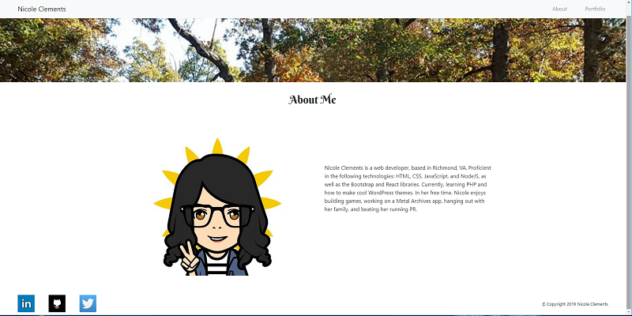

# Portfolio Page

## Find app at:

https://nkclem.github.io/Bootstrap_Portfolio/

### Overview

Portfolio webpage showing personal projects I have completed or worked on.

-----------------------------------------
#### Updated March 2019 

-----------------------------------------

Front-end is built with the Bootstrap 4 library.

Page routing and the content of the portfolio page are built with JavaScript and jQuery.

-----------------------------------------

## Screenshots

<table>
    <tr>
        <td>
            
        </td>
    </tr>
    <tr>
        <td>
            
        </td>
    </tr>
    <tr>
        <td>
            
        </td>
    </tr>
</table>

-----------------------------------------

## History

This project was, originally, conceived and created as part of the University of Richmond Coding Bootcamp Curriculum (October 2017).  Recently updated to include updated Bootstrap components and new projects.

